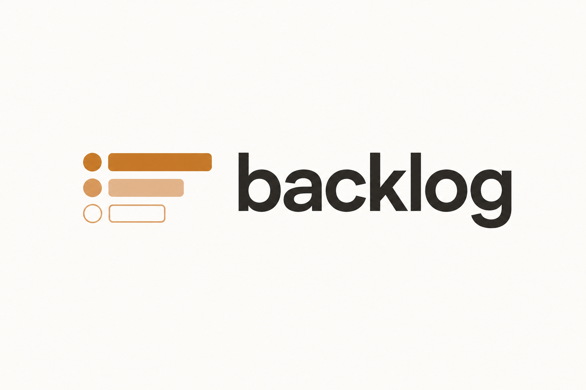
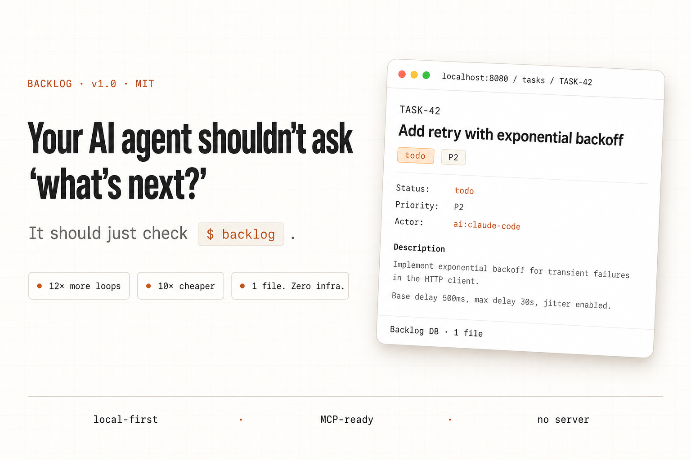
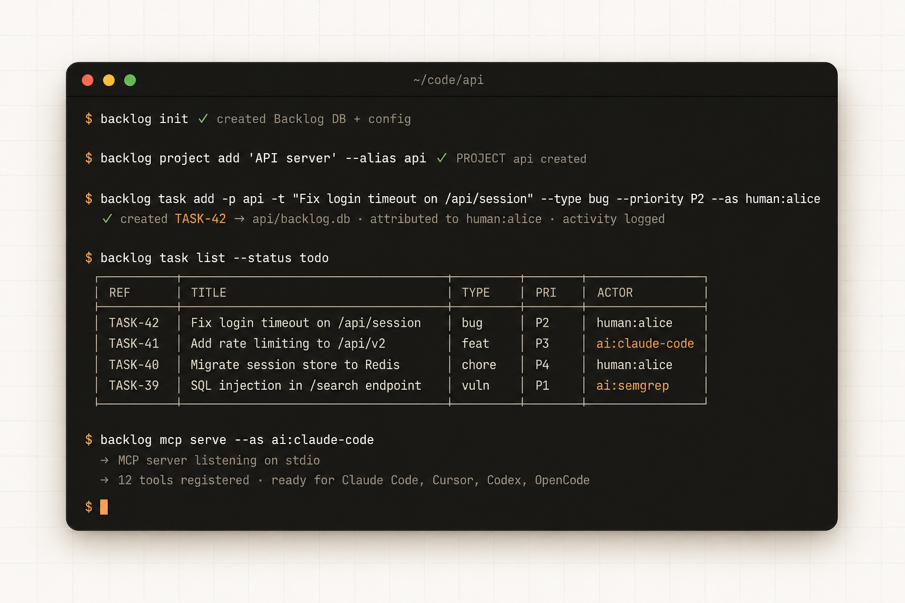
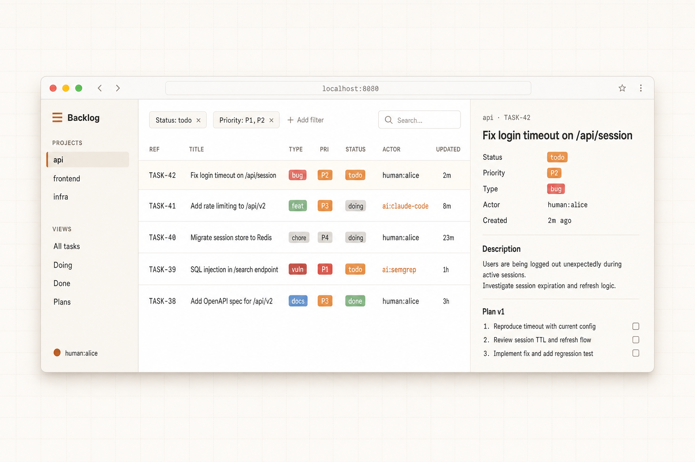
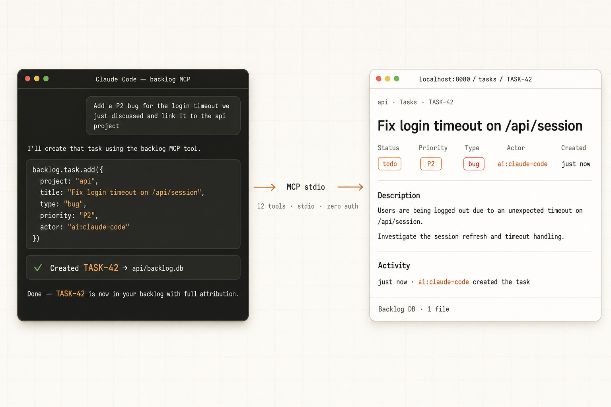
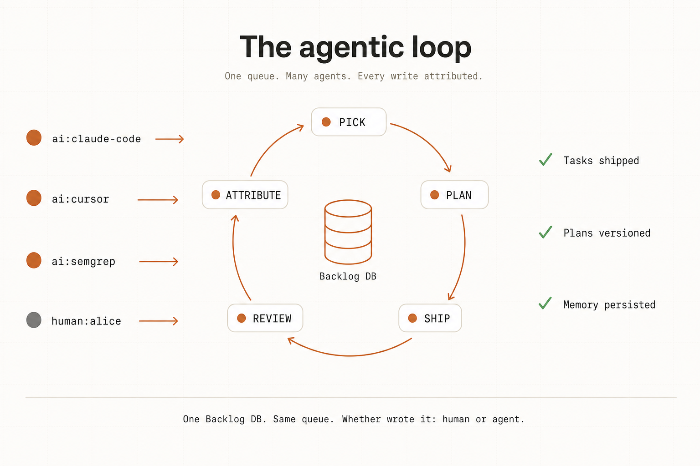

<div align="center">

<picture>
  <source media="(prefers-color-scheme: dark)" srcset="assets/logo-lockup-dark.png">
  
</picture>

<br><br>



<br>

**A local-first task queue and database your AI coding agents can read and write directly.**

[](https://github.com/mazen160/backlog/actions/workflows/ci.yml)
[](https://github.com/mazen160/backlog/releases/latest)
[](LICENSE)
[](https://github.com/mazen160/backlog/stargazers)

[**Website**](https://mazen160.github.io/backlog/) · [**Docs**](https://mazen160.github.io/backlog/docs.html) · [**MCP setup**](https://mazen160.github.io/backlog/mcp.html) · [**Changelog**](CHANGELOG.md)

</div>

---

## Why Backlog

Most AI coding agents lose state the moment a chat ends. Their "memory" is a 500k-token thread that costs you a subscription and forgets the project the next morning.

Backlog moves the queue out of the chat and into a **Backlog DB** your agents read and write through MCP. Same database your CLI uses. Same database your other agents use. Every write is signed by the actor that made it (`human:alice`, `ai:claude-code`, `ai:semgrep`), so you always know who did what.

The result is the **agentic loop**: spawn a fresh subagent, let it pull a task, plan, ship, and exit — then do it again. Four parallel sessions, ~12× the throughput of one developer running one agent, ~10× cheaper per task than a long-running thread.

> **One queue. Many agents. Every write attributed.**

---

## Install

Grab a [pre-built binary](https://github.com/mazen160/backlog/releases/latest) for macOS or Linux (arm64 + amd64):

```sh
OS=$(uname -s | tr '[:upper:]' '[:lower:]')
ARCH=$(uname -m | sed 's/x86_64/amd64/;s/aarch64/arm64/')
curl -L https://github.com/mazen160/backlog/releases/latest/download/backlog_${OS}_${ARCH}.tar.gz | tar xz
sudo mv backlog /usr/local/bin/
```

Or install from source:

```sh
go install github.com/mazen160/backlog/cmd/backlog@latest
```

One binary. No dependencies. No runtime to install.

---

## See it

<div align="center">



*Everything runs from your shell. `backlog init` creates the Backlog DB. Every command attributes the write to the actor who made it.*

<br>



*`backlog web` serves a clean, inline-editable dashboard from the same Backlog DB. Tasks created from a CLI or an AI agent show up here instantly with full attribution.*

<br>



*Wire Backlog into Claude Code, Cursor, Codex, or OpenCode via MCP. Your agent's writes land in the same database your shell reads from — fully attributed to the AI that made them.*

</div>

---

## The agentic loop

<div align="center">



</div>

A loop is one unit of work: **pick → plan → ship → review → attribute**. Backlog stores the queue, attributes every step, and keeps multiple agent sessions from stepping on each other.

Each task spawns a fresh subagent with only the context it needs. The average session fits in **under 50k tokens** instead of the 500k a long-running thread bloats into. Same quality, dramatically cheaper.

---

## Quickstart

```sh
# 1. Create a workspace in your project directory
backlog init

# 2. Add a project
backlog project add "My App" --alias app

# 3. Create some tasks
backlog task add -p app -t "Fix login timeout" --type bug --priority P2
backlog task add -p app -t "Add rate limiting" --type feature --priority P3

# 4. See what's open
backlog task list

# 5. Start working on TASK-1
backlog task move TASK-1 --status doing

# 6. Attach a versioned plan
backlog plan add --task TASK-1 --title "Fix plan" \
  --content "1. Increase timeout\n2. Add test"

# 7. Done
backlog task move TASK-1 --status done
```

That's the whole workflow. No accounts. No webhooks. No SaaS.

For step-by-step setup, see [Getting Started](https://mazen160.github.io/backlog/getting-started.html).

---

## Features

- **Local-first** — the Backlog DB sits next to your code. Commits with your repo (or doesn't — your call).
- **Single binary** — ~17 MB. No runtime, no dependencies, no daemon.
- **JIRA-style refs** — tasks are `TASK-1`, `TASK-2`, … No UUIDs in your terminal.
- **Versioned plans** — every plan edit creates an immutable version. Full history is always readable.
- **Actor attribution** — every write is signed `human:name` or `ai:name`. Filter, audit, blame.
- **MCP server** — plug into Claude Code, Cursor, Codex, OpenCode, or anything that speaks MCP.
- **Full-text search** — `backlog task list --search "injection*"` runs in milliseconds.
- **Bulk findings import** — structured JSON intake for security scanners and AI agents.
- **Web UI** — `backlog web` serves a clean dashboard from the same Backlog DB.
- **Export anywhere** — JSON, CSV, or Markdown.
- **HTTP API** — embedded server for scripts and integrations.
- **No telemetry, no tracking** — period.

---

## CLI reference

| Command | Description |
|---|---|
| `backlog init` | Create a Backlog workspace |
| `backlog project add/list/show/update/archive` | Manage projects |
| `backlog task add/list/show/update/move/archive` | Manage tasks |
| `backlog plan add/update/show/history` | Versioned plans on tasks |
| `backlog comment add/list` | Comments on tasks |
| `backlog label create/attach/detach` | Per-project labels |
| `backlog import-findings <file.json>` | Bulk import from scanners/agents |
| `backlog import <other.db>` | Merge another workspace |
| `backlog export --format json\|csv\|md` | Export tasks |
| `backlog sync` | Reconcile `backlog.json` with DB |
| `backlog mcp serve` | Start MCP stdio server |
| `backlog web` | Serve the web UI |
| `backlog doctor check\|backup` | Health check and backup |
| `backlog schema` | Print JSON Schema for all payload types |
| `backlog profile add/list/set-default` | Named workspace shortcuts |

Full reference: [CLI Reference](https://mazen160.github.io/backlog/cli.html).

---

## Actor attribution

Every command accepts `--as kind:name`. Without it, the actor defaults to `human:$USER`.

```sh
backlog task add -p app -t "Investigate memory leak" --as human:alice

backlog plan add --task TASK-1 --title "Memory profiling plan" \
  --content "Run pprof on /api/v2/search endpoint" \
  --as ai:claude-code

backlog task list --actor-kind ai
backlog task list --actor-name alice
```

Every row in the Backlog DB carries the actor that wrote it. Audit trails are free.

---

## MCP server

Connect any MCP-compatible AI assistant directly to your backlog:

```sh
backlog mcp serve --as ai:claude-code --db /path/to/backlog.db
```

**Claude Code** (`~/.claude.json`):

```json
{
  "mcpServers": {
    "backlog": {
      "command": "backlog",
      "args": ["mcp", "serve", "--as", "ai:claude-code"],
      "env": { "BACKLOG_DB": "/path/to/backlog.db" }
    }
  }
}
```

Setup for Cursor, Codex, and OpenCode: [MCP guide](https://mazen160.github.io/backlog/mcp.html).

---

## Findings import

Security scanners and AI agents can write a structured JSON file and bulk-import:

```sh
cat > findings.json << 'EOF'
{
  "version": 1,
  "project": "app",
  "items": [
    {
      "title": "SQL injection in /search",
      "type": "vulnerability",
      "priority": "P1",
      "source": "semgrep",
      "plans": [{ "title": "Fix", "body": "Use parameterized queries." }]
    }
  ]
}
EOF

backlog import-findings findings.json --as ai:semgrep
```

Every finding becomes a task. Every task is attributed to the scanner that found it.

---

## Documentation

| Page | Description |
|---|---|
| [Getting Started](https://mazen160.github.io/backlog/getting-started.html) | Install, init, first task, plans, MCP setup |
| [Core Concepts](https://mazen160.github.io/backlog/concepts.html) | Workspaces, projects, tasks, plans, actors, profiles |
| [CLI Reference](https://mazen160.github.io/backlog/cli.html) | Every command and flag with examples |
| [MCP](https://mazen160.github.io/backlog/mcp.html) | Wire into Claude Code, Cursor, Codex, OpenCode |
| [Skills](https://mazen160.github.io/backlog/skills.html) | The four embedded agentic-loop skills |
| [HTTP API](https://mazen160.github.io/backlog/api.html) | Routes exposed by `backlog web` |
| [Working Across Sessions](https://mazen160.github.io/backlog/working-across-sessions.html) | Three-day cross-session walkthrough |

---

## Development

```sh
git clone https://github.com/mazen160/backlog
cd backlog
make build      # build binary
make test       # run all tests
make fmt        # gofmt
make vet        # go vet
make cover      # test + coverage report
```

See [`CONTRIBUTING.md`](CONTRIBUTING.md) for the full guide.

---

## Found this useful?

If Backlog saves you a context window, please [**star the repo**](https://github.com/mazen160/backlog) — it's the only signal that tells me to keep building it in the open.

Share what you build:

[](https://twitter.com/intent/tweet?text=Your%20AI%20agent%20shouldn%27t%20ask%20%22what%27s%20next%3F%22%20%E2%80%94%20it%20should%20just%20check%20%24%20backlog.%0A%0AA%20local-first%20task%20queue%20your%20AI%20coding%20agents%20can%20read%20and%20write.&url=https%3A%2F%2Fgithub.com%2Fmazen160%2Fbacklog&hashtags=AIAgents,AgenticLoop,DevTools)
[](https://news.ycombinator.com/submitlink?u=https%3A%2F%2Fgithub.com%2Fmazen160%2Fbacklog&t=Show%20HN%3A%20Backlog%20%E2%80%93%20a%20local-first%20task%20queue%20your%20AI%20coding%20agents%20can%20read%20and%20write)
[](https://www.reddit.com/submit?url=https%3A%2F%2Fgithub.com%2Fmazen160%2Fbacklog&title=Backlog%20%E2%80%93%20a%20local-first%20task%20queue%20your%20AI%20coding%20agents%20can%20read%20and%20write)
[](https://www.linkedin.com/sharing/share-offsite/?url=https%3A%2F%2Fgithub.com%2Fmazen160%2Fbacklog)

---

## Under the hood

The Backlog DB is an embedded SQLite store with WAL mode, full-text search (FTS5), and atomic backups. Backlog itself is written in Go and ships as a single static binary.

---

## License

The project is currently licensed under [MIT License](LICENSE).

---

## Author

**Mazin Ahmed**

- Website: [https://mazinahmed.net](https://mazinahmed.net)
- Email: mazin [at] mazinahmed [dot] net
- Twitter: [https://twitter.com/mazen160](https://twitter.com/mazen160)
- LinkedIn: [http://linkedin.com/in/infosecmazinahmed](http://linkedin.com/in/infosecmazinahmed)
- GitHub: [https://github.com/mazen160](https://github.com/mazen160)
