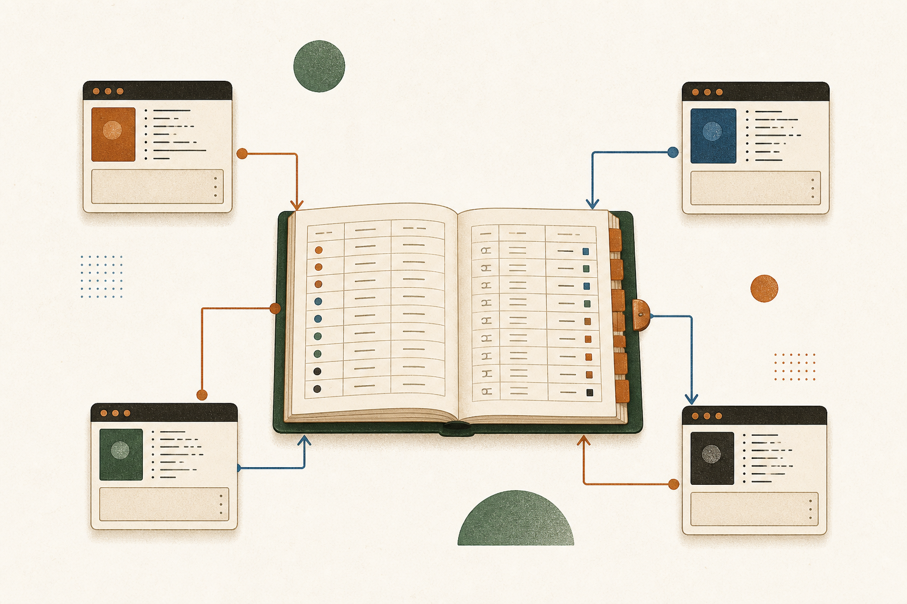
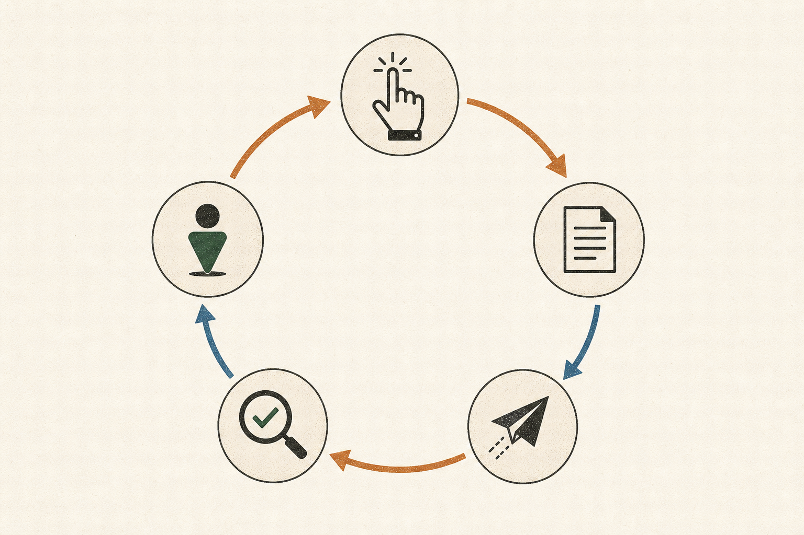
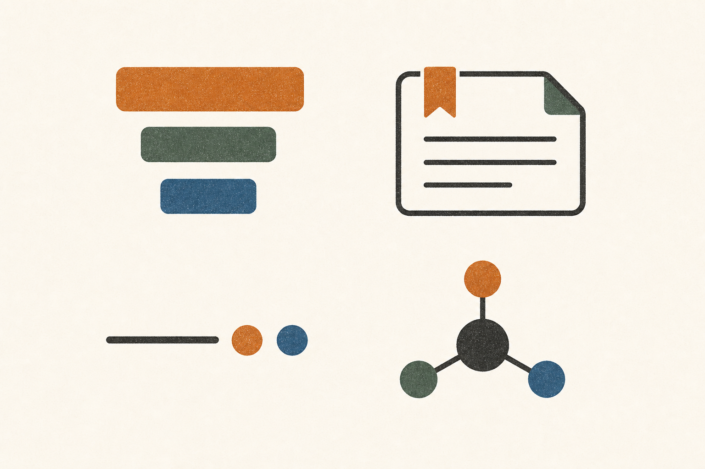

<div align="center">

<picture>
  <source media="(prefers-color-scheme: dark)" srcset="assets/logo-lockup-dark.png">
  
</picture>

<br><br>


<br>

**A local-first task and context manager for humans and AI. One database your coding agents read and write directly.**

[](https://github.com/mazen160/backlog/actions/workflows/ci.yml)
[](https://github.com/mazen160/backlog/releases/latest)
[](LICENSE)
[](https://github.com/mazen160/backlog/stargazers)

[**Website**](https://mazen160.github.io/backlog/) · [**Docs**](https://mazen160.github.io/backlog/docs.html) · [**MCP setup**](https://mazen160.github.io/backlog/mcp.html) · [**Changelog**](CHANGELOG.md)

</div>

---

## Why Backlog

Most AI coding agents lose state the moment a chat ends. Their "memory" is a 500k-token thread that costs you a subscription and forgets the project the next morning.

Backlog moves the queue, and everything the agent learns, out of the chat and into a **Backlog DB** your agents read and write directly. Tasks, plans, docs, and memory live in one SQLite file that your CLI, your web UI, and every agent share. Every write is signed by the actor that made it (`human:alice`, `ai:claude-code`, `ai:semgrep`), so you always know who did what.

The result is the **agentic loop**: spawn a fresh subagent, let it load the project's context, pull a task, plan, ship, and exit, then do it again. Four parallel sessions, ~12× the throughput of one developer running one agent, ~10× cheaper per task than a long-running thread.

> **One queue. Many agents. Every write attributed.**

<div align="center">



</div>

---

## Install

Grab a [pre-built binary](https://github.com/mazen160/backlog/releases/latest) for macOS or Linux (arm64 + amd64):

```sh
OS=$(uname -s | tr '[:upper:]' '[:lower:]')
ARCH=$(uname -m | sed 's/x86_64/amd64/;s/aarch64/arm64/')
curl -L https://github.com/mazen160/backlog/releases/latest/download/backlog_${OS}_${ARCH}.tar.gz | tar xz
sudo mv backlog /usr/local/bin/
```

Or install from source:

```sh
go install github.com/mazen160/backlog/cmd/backlog@latest
```

It's one binary with no dependencies and no runtime to install.

---

## See it

<div align="center">


*Everything runs from your shell. `backlog init` creates the Backlog DB. Every command attributes the write to the actor who made it.*

<br>


*`backlog web` serves a clean, inline-editable dashboard from the same Backlog DB. Tasks created from a CLI or an AI agent show up here instantly with full attribution.*

<br>


*Wire Backlog into Claude Code, Cursor, Codex, or OpenCode. Your agent's writes land in the same database your shell reads from, fully attributed to the AI that made them.*

</div>

---

## The agentic loop

<div align="center">



</div>

A loop is one unit of work: **pick → plan → ship → review → attribute**. Backlog stores the queue, attributes every step, and keeps multiple agent sessions from stepping on each other.

Each task spawns a fresh subagent with only the context it needs. The average session fits in **under 50k tokens** instead of the 500k a long-running thread bloats into. Same quality, dramatically cheaper.

---

## Quickstart

```sh
# 1. Create a workspace in your project directory
backlog init

# 2. Add a project
backlog project add "My App" --alias app

# 3. Create some tasks
backlog task add -p app -t "Fix login timeout" --type bug --priority P2
backlog task add -p app -t "Add rate limiting" --type feature --priority P3

# 4. See what's open
backlog task list

# 5. Start working on TASK-1
backlog task move TASK-1 --status doing

# 6. Attach a versioned plan
backlog plan add --task TASK-1 --title "Fix plan" \
  --content "1. Increase timeout\n2. Add test"

# 7. Done
backlog task move TASK-1 --status done
```

That's the whole workflow, and it runs entirely on your machine. There's no account to create and no service to host or pay for.

Once the skills are installed (`backlog install-skills`), an agent does the same from a prompt. In Claude Code:

```text
> show me the open tasks in app and start the top one

⏺ I'll check the open tasks and start the top one.

⏺ Bash(backlog task list -p app --status todo)
  ⎿  TASK-1  Fix login timeout   bug   P2   todo
     TASK-2  Add rate limiting   feat  P3   todo

⏺ Bash(backlog task move TASK-1 --status doing --as ai:claude-code)
  ⎿  ✓ TASK-1 → doing

⏺ Bash(backlog comment add --task TASK-1 "Picking this up. Reproducing the timeout first." --as ai:claude-code)
  ⎿  ✓ comment added to TASK-1

⏺ Started TASK-1 (Fix login timeout, P2). Reproducing the timeout now.
```

For step-by-step setup, see [Getting Started](https://mazen160.github.io/backlog/getting-started.html).

---

## Connect your coding agent

`backlog install-skills` drops a set of ready-made skills into Claude Code, Cursor, Codex, and OpenCode. From there your agent drives Backlog through the CLI directly. No server to run, no MCP to configure.

```sh
backlog install-skills
```

The skills it installs:

| Skill | What it does |
|---|---|
| `backlog` | The core loop: load context, pick a task, plan, ship, and attribute every write. |
| `/backlog-memory` | Load a project's tasks, plans, docs, and memory into the session (`learn`), or persist a fresh snapshot when the work is done (`store`). |
| `/backlog-enhance-tasks` | Flesh out a thin ticket's title and description, and draft a plan. |
| `/backlog-loop` | Pull the top task and iterate on it until a reviewer sub-agent agrees it's done. |
| `/backlog-goal` | Take a whole goal, break it into tickets, and work the board end to end. |

Prefer tool calls? Backlog also speaks MCP. See [MCP server](#mcp-server).

---

## Concepts

A quick glossary of the vocabulary used throughout Backlog. Full detail in [Core Concepts](https://mazen160.github.io/backlog/concepts.html).

| Term | What it is |
|---|---|
| **Workspace** | A directory holding a `backlog.db` (and a `config.toml`). Every project, task, plan, and comment lives in that one SQLite file. Created by `backlog init`. |
| **Profile** | A named pointer to a workspace, registered in `~/.config/backlog/config.toml`, so you can switch workspaces without typing paths. |
| **Project** | A named group of tasks inside a workspace, identified by a short **alias** (e.g. `api`). The alias is what you pass to `-p` / `--project`. |
| **Task** | The unit of work. Has a type, status, priority, and actor; addressed as `TASK-N`. |
| **Plan** | A versioned markdown document attached to a task. Every edit creates a new immutable version; the full history stays readable. |
| **Comment** | An append-only, actor-attributed note on a task. |
| **Label** | A per-project tag for filtering tasks. |
| **Doc** | A versioned markdown document attached to a *project* (not a task): runbooks, ADRs, design notes. |
| **Memory** | A free-form, taggable, mutable note for cross-session agent context. |
| **Actor** | The `human:name` or `ai:name` attributed to every write. |
| **Activity** | An append-only log of every write across the workspace. |

---

## Features

<div align="center">



</div>

- **Local-first.** The Backlog DB sits next to your code. Commits with your repo, or doesn't (your call).
- **Single binary.** A ~17 MB static binary with nothing else to install or keep running.
- **JIRA-style refs.** Tasks are `TASK-1`, `TASK-2`, … No UUIDs in your terminal.
- **Versioned plans.** Every plan edit creates an immutable version. Full history is always readable.
- **Actor attribution.** Every write is signed `human:name` or `ai:name`. Filter, audit, blame.
- **Persistent project context.** Memory, docs, and plans live in the DB, so a fresh agent session loads the full picture instead of re-reading the codebase.
- **Agent skills.** `backlog install-skills` drops ready-made skills into Claude Code, Cursor, Codex, and OpenCode; your agent drives the queue and its own memory with no extra wiring.
- **MCP server.** Optionally plug in over MCP, for agents that prefer tool calls.
- **Full-text search.** `backlog task list --search "injection*"` runs in milliseconds.
- **Workflow health reports.** `backlog activity analyze` and `backlog doctor project` surface cycle time, stale work, and weakly-closed tasks across parallel agent sessions.
- **Bulk findings import.** Structured JSON intake for security scanners and AI agents.
- **Web UI.** `backlog web` serves a clean dashboard from the same Backlog DB.
- **Export anywhere.** JSON, CSV, or Markdown.
- **HTTP API.** Embedded server for scripts and integrations.
- **Private by default.** Everything stays on your machine, and Backlog collects nothing about you.

---

## CLI reference

| Command | Description |
|---|---|
| `backlog init` | Create a Backlog workspace |
| `backlog project add/list/show/update/archive` | Manage projects |
| `backlog task add/list/show/update/move/archive` | Manage tasks |
| `backlog plan add/update/show/history` | Versioned plans on tasks |
| `backlog comment add/list` | Comments on tasks |
| `backlog label create/attach/detach` | Per-project labels |
| `backlog memory add/list/append` | Cross-session project memory |
| `backlog doc add/list/show/update/history` | Versioned project docs |
| `backlog attachment add/list/fetch/delete` | Files attached to tasks or docs |
| `backlog activity / activity analyze` | Audit trail and project workflow-health report |
| `backlog doctor project` | Lint a project for stale, orphaned, and weakly-closed work |
| `backlog import-findings <file.json>` | Bulk import from scanners/agents |
| `backlog import <other.db>` | Merge another workspace |
| `backlog export --format json\|csv\|md` | Export tasks |
| `backlog sync` | Reconcile `backlog.json` with DB |
| `backlog mcp serve` | Start MCP stdio server (optional) |
| `backlog install-skills` | Install agent skills into Claude Code, Cursor, Codex, OpenCode |
| `backlog web` | Serve the web UI |
| `backlog doctor check\|backup` | Health check and backup |
| `backlog schema` | Print JSON Schema for all payload types |
| `backlog profile add/list/set-default` | Named workspace shortcuts |

Full reference: [CLI Reference](https://mazen160.github.io/backlog/cli.html).

---

## Actor attribution

Every command accepts `--as kind:name`. Without it, the actor defaults to `human:$USER`.

```sh
backlog task add -p app -t "Investigate memory leak" --as human:alice

backlog plan add --task TASK-1 --title "Memory profiling plan" \
  --content "Run pprof on /api/v2/search endpoint" \
  --as ai:claude-code

backlog task list --actor-kind ai
backlog task list --actor-name alice
```

Every row in the Backlog DB carries the actor that wrote it. Audit trails are free.

---

## MCP server

[Skills](#connect-your-coding-agent) are the simplest way to connect an agent. If you'd rather use MCP tool calls, Backlog also runs as an MCP server. Connect any MCP-compatible AI assistant directly to your backlog:

```sh
backlog mcp serve --as ai:claude-code --db /path/to/backlog.db
```

**Claude Code** (`~/.claude.json`):

```json
{
  "mcpServers": {
    "backlog": {
      "command": "backlog",
      "args": ["mcp", "serve", "--as", "ai:claude-code"],
      "env": { "BACKLOG_DB": "/path/to/backlog.db" }
    }
  }
}
```

Setup for Cursor, Codex, and OpenCode: [MCP guide](https://mazen160.github.io/backlog/mcp.html).

---

## Findings import

Security scanners and AI agents can write a structured JSON file and bulk-import:

```sh
cat > findings.json << 'EOF'
{
  "version": 1,
  "project": "app",
  "items": [
    {
      "title": "SQL injection in /search",
      "type": "vulnerability",
      "priority": "P1",
      "source": "semgrep",
      "plans": [{ "title": "Fix", "body": "Use parameterized queries." }]
    }
  ]
}
EOF

backlog import-findings findings.json --as ai:semgrep
```

Every finding becomes a task. Every task is attributed to the scanner that found it.

---

## Workflow health

When several agents are closing tasks against the same queue, an empty backlog doesn't mean the work was done well. Two read-only reports tell you whether it actually was:

```sh
# How is this project trending over the last week?
backlog activity analyze --project app --since 7d
```

Cycle time by task type, status-transition latency (todo→doing, doing→done), WIP by actor, reopened work, bug follow-ups, label churn, and the human-vs-AI close ratio. One report, no dashboard required. Add `--json` to pipe it into your own.

```sh
# What did the agents close badly?
backlog doctor project --project app
```

Flags stale `doing` tasks, tasks created but never started, tasks closed with no plan or completion evidence, and final-audit tasks marked done while earlier work is still open. Every issue carries a severity, a code, and the evidence behind it, so the next agent (or you) can fix it instead of rediscovering it.

---

## Documentation

| Page | Description |
|---|---|
| [Getting Started](https://mazen160.github.io/backlog/getting-started.html) | Install, init, first task, plans, agent skills |
| [Core Concepts](https://mazen160.github.io/backlog/concepts.html) | Workspaces, projects, tasks, plans, actors, profiles |
| [CLI Reference](https://mazen160.github.io/backlog/cli.html) | Every command and flag with examples |
| [MCP](https://mazen160.github.io/backlog/mcp.html) | Wire into Claude Code, Cursor, Codex, OpenCode |
| [Skills](https://mazen160.github.io/backlog/skills.html) | The five embedded agentic-loop skills |
| [HTTP API](https://mazen160.github.io/backlog/api.html) | Routes exposed by `backlog web` |
| [Working Across Sessions](https://mazen160.github.io/backlog/working-across-sessions.html) | Three-day cross-session walkthrough |

---

## Development

```sh
git clone https://github.com/mazen160/backlog
cd backlog
make build      # build binary
make test       # run all tests
make fmt        # gofmt
make vet        # go vet
make cover      # test + coverage report
```

See [`CONTRIBUTING.md`](CONTRIBUTING.md) for the full guide.

---

## Found this useful?

If Backlog saves you a context window, please [**star the repo**](https://github.com/mazen160/backlog). It's the only signal that tells me to keep building it in the open.

Share what you build:

[](https://twitter.com/intent/tweet?text=Your%20AI%20agent%20shouldn%27t%20ask%20%22what%27s%20next%3F%22%20%E2%80%94%20it%20should%20just%20check%20%24%20backlog.%0A%0AA%20local-first%20task%20and%20context%20manager%20your%20AI%20coding%20agents%20read%20and%20write%20directly.&url=https%3A%2F%2Fgithub.com%2Fmazen160%2Fbacklog&hashtags=AIAgents,AgenticLoop,DevTools)
[](https://news.ycombinator.com/submitlink?u=https%3A%2F%2Fgithub.com%2Fmazen160%2Fbacklog&t=Show%20HN%3A%20Backlog%20%E2%80%93%20a%20local-first%20task%20and%20context%20manager%20your%20AI%20coding%20agents%20read%20and%20write%20directly)
[](https://www.reddit.com/submit?url=https%3A%2F%2Fgithub.com%2Fmazen160%2Fbacklog&title=Backlog%20%E2%80%93%20a%20local-first%20task%20and%20context%20manager%20your%20AI%20coding%20agents%20read%20and%20write%20directly)
[](https://www.linkedin.com/sharing/share-offsite/?url=https%3A%2F%2Fgithub.com%2Fmazen160%2Fbacklog)

---

## Under the hood

<div align="center">


</div>

The Backlog DB is an embedded SQLite store with WAL mode, full-text search (FTS5), and atomic backups. Backlog itself is written in Go and ships as a single static binary.

---

## License

The project is currently licensed under [MIT License](LICENSE).

---

## Author

**Mazin Ahmed**

- Website: [https://mazinahmed.net](https://mazinahmed.net)
- Email: mazin [at] mazinahmed [dot] net
- Twitter: [https://twitter.com/mazen160](https://twitter.com/mazen160)
- LinkedIn: [http://linkedin.com/in/infosecmazinahmed](http://linkedin.com/in/infosecmazinahmed)
- GitHub: [https://github.com/mazen160](https://github.com/mazen160)
