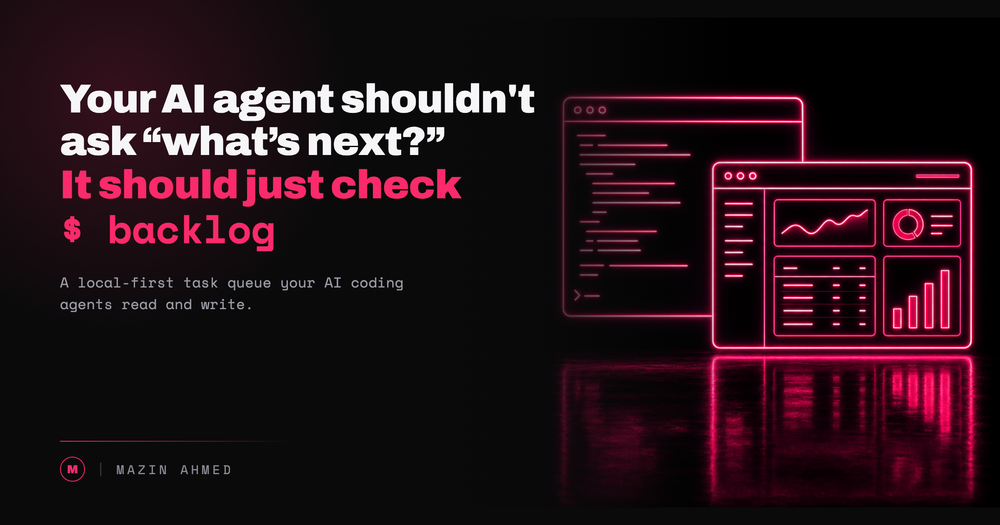

# Backlog: A Local-First Task and Context Manager for Humans and AI

I've been working with agentic AI for years, and I kept hitting the same wall. Managing the tasks and to-dos it generates. Transferring knowledge between sessions. Improving a product without keeping a single session open for days.

Keeping a session open for days builds up context. And when I send a request to Claude, I'm charged for the whole thing. Compression helps, but it's still expensive. The agent forgets what happened, the small details, and there's no real way to hold onto any of it.

So I started building Backlog, an AI task and context manager made for humans and AI. It's a local-first task queue for coding agents that lets you keep notes, to-dos, tasks, and project documentation in Markdown. It keeps everything organized, tracks status, and stops the mess of scattered artifacts. It also stores an activity log for every task, along with plans, documentation, lessons learned, and memories, all inside the project.


*One database at the center. Every agent reads and writes the same queue, and every write is attributed.*

It works with Claude Code, Cursor, Codex, OpenCode, and any other agent that can call an API. There's a visual UI, so you can see what your agents are working on and where they are. Agents leave comments like a human engineer would, tracking the changes they make on each task.

Here's a concrete example. I run a code review on a repository and it generates 40 changes. Backlog creates a ticket for each one, let an agent pick them up, and the agent updates each ticket with the change it made and the lessons it learned. At the end of the session, I ask the agent to store its memory in Backlog, so everything stays consistent. When I start a new session, I read that memory and immediately know the project and the lessons learned, without re-reading the whole thing.

I also built a skill, `/backlog-enhance-tasks`, that updates research items directly inside a ticket without me in the loop. The UI lets me navigate every ticket and its progress.


*The same database in the browser. Human and agent writes sit side by side, each tagged with who made it.*

I've used Backlog for the past 30 days on internal projects, and it has significantly boosted both my productivity and the quality of the changes. I've also built four different projects using the time saved here I'll release soon, all powered by Backlog.

A few of the ways I use it. I no longer keep random documentation artifacts lying around - everything lives as a document inside Backlog. I run regular discovery and security reviews on codebases, store the findings in Backlog, and have another agent resolve them. I store the memory of changes and lessons learned for each project, assign them inside the project, and trace them later.


```sh
go install github.com/mazen160/backlog/cmd/backlog@latest
backlog init
backlog install-skills
```

The code is at github.com/mazen160/backlog.

I'll end with the question I keep coming back to. When your agent finishes a session, where does everything it learned go? If the answer is "the chat," it's already gone. If the answer is CLAUDE.md, it's probably too messy and missing lots of context right now.

Best Regards,
Mazin
